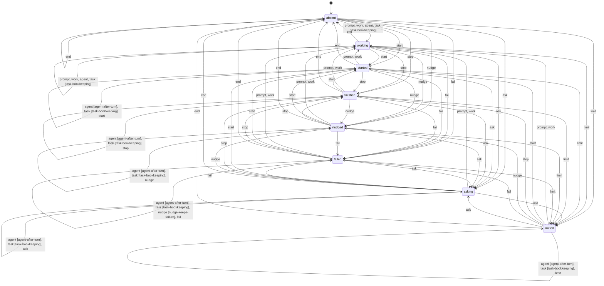
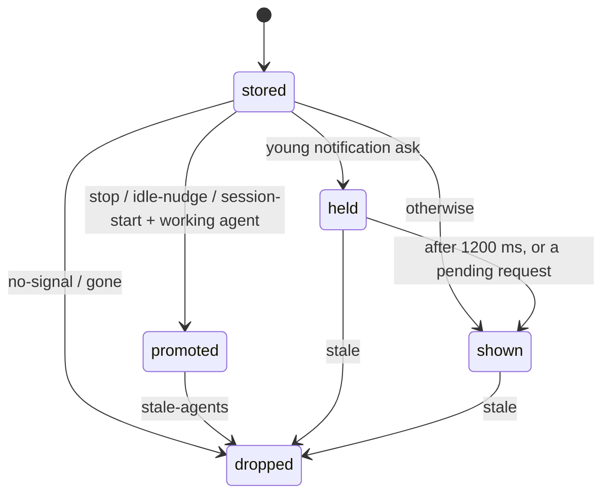

# Session state machine

<!-- Generated by scripts/state-machine-doc.js from hooks/session-machine.js. Do not edit by hand. -->

Every Claude Code session (and every other agent reporting through `emit.js`
or the app's `/signal` endpoint) is a session file whose stored signal puts it
in one state of a small machine. The **writer** side — which signal a hook
leaves on the file — is `step()`; the **reader** side — what the widget shows
for a stored session right now — is `classify()`. Both live in
`hooks/session-machine.js`, are pure, and are what `set-status.js`,
`session-state.js` (bare signals), `main.js` and `mcp-server.js` call.

## States

| state | stored signal |
|---|---|
| `absent` | no session file |
| `working` | any signal that does not end the turn |
| `started` | `session-start` |
| `asking` | `permission-ask` |
| `limited` | `limit-hit` |
| `finished` | `stop` |
| `nudged` | `idle-nudge` |
| `failed` | `turn-failed` |

Every state but `absent` and `working` has closed the turn (`TURN_END`):
the working-since clock stops there.

## Events

| event | resolved hook signals |
|---|---|
| `prompt` | `prompt-submit` |
| `work` | `tool-use`, `tool-done`, `tool-failed`, `compact`, `permission-denied` |
| `agent` | `subagent-start`, `subagent-done`, tool-* or permission-denied carrying an agent_id |
| `task` | `task-created`, `task-done` |
| `start` | `session-start` |
| `stop` | `stop` |
| `nudge` | `idle-nudge` |
| `fail` | `turn-failed` |
| `ask` | `permission-ask` |
| `limit` | `limit-hit` |
| `end` | `session-end` |

A Notification is resolved first: `permission_prompt` / elicitation →
`permission-ask`, `idle_prompt` → `idle-nudge`, usage-limit text →
`limit-hit`; a PermissionRequest and an AskUserQuestion tool use are
`permission-ask` too. A SessionStart after a compaction (`source: compact`)
is `compact`: the session is carrying on, not freshly opened.

## Transition rules

First matching rule wins.

| rule | from | on | to | writer | why |
|---|---|---|---|---|---|
| `end` | any | `end` | absent | all | SessionEnd removes the file |
| `task-bookkeeping` | any | `task` | keep (bookkeeping) | hook only | task events only count; they never change what the session is doing |
| `agent-after-turn` | started, asking, limited, finished, nudged, failed | `agent` | keep (bookkeeping) | all | a background agent working after the turn ended must not look like the turn restarted |
| `nudge-keeps-failure` | failed | `nudge` | keep | all | the idle nudge ~60 s after a failed turn must not turn "the network dropped" into "waiting for you" |
| `signal` | any | any | signal | all | anything else is what the session is now doing |

`keep` leaves the stored signal (and its tool, ask kind, via and failure)
as it was. **Bookkeeping** rows update agent and task lists but must not look
like the session moved: `updatedAt` holds, `agentsAt` is stamped, and a
closed turn keeps its `workingSince`. A bare signal (`emit.js`, `/signal`)
goes through the same guards; it carries no `agent_id`, so only its
`subagent-*` signals are agent events. Hook-only rows need data only the
hook has (task counting), so a bare writer skips them.

## Transition table (Claude Code hooks)

Target state for every (state, event) pair. **Bold¹** marks a guarded
`keep`: the event did not change what the session shows.

| from \ event | prompt | work | agent | task | start | stop | nudge | fail | ask | limit | end |
|---|---|---|---|---|---|---|---|---|---|---|---|
| **absent** | working | working | working | **working**¹ | started | finished | nudged | failed | asking | limited | absent |
| **working** | working | working | working | **working**¹ | started | finished | nudged | failed | asking | limited | absent |
| **started** | working | working | **started**¹ | **started**¹ | started | finished | nudged | failed | asking | limited | absent |
| **asking** | working | working | **asking**¹ | **asking**¹ | started | finished | nudged | failed | asking | limited | absent |
| **limited** | working | working | **limited**¹ | **limited**¹ | started | finished | nudged | failed | asking | limited | absent |
| **finished** | working | working | **finished**¹ | **finished**¹ | started | finished | nudged | failed | asking | limited | absent |
| **nudged** | working | working | **nudged**¹ | **nudged**¹ | started | finished | nudged | failed | asking | limited | absent |
| **failed** | working | working | **failed**¹ | **failed**¹ | started | finished | **failed**¹ | failed | asking | limited | absent |

Bare signals (`emit.js`, `/signal`) differ only where a hook-only row
would have applied:

| from \ event | prompt | work | agent | task | start | stop | nudge | fail | ask | limit | end |
|---|---|---|---|---|---|---|---|---|---|---|---|
| **absent** | working | working | working | working | started | finished | nudged | failed | asking | limited | absent |
| **working** | working | working | working | working | started | finished | nudged | failed | asking | limited | absent |
| **started** | working | working | **started**¹ | working | started | finished | nudged | failed | asking | limited | absent |
| **asking** | working | working | **asking**¹ | working | started | finished | nudged | failed | asking | limited | absent |
| **limited** | working | working | **limited**¹ | working | started | finished | nudged | failed | asking | limited | absent |
| **finished** | working | working | **finished**¹ | working | started | finished | nudged | failed | asking | limited | absent |
| **nudged** | working | working | **nudged**¹ | working | started | finished | nudged | failed | asking | limited | absent |
| **failed** | working | working | **failed**¹ | working | started | finished | **failed**¹ | failed | asking | limited | absent |

## Diagram

## Reading a session (what the widget shows)

`classify()` runs on every stored session at every poll. The first row that
applies decides; only `held`, `promoted` and `shown` put the session in
front of the rules engine.

| # | outcome | shows | when |
|---|---|---|---|
| 1 | `no-signal` | nothing | no signal (and no legacy colour) in the file |
| 2 | `gone` | nothing | its local Claude process exited without a SessionEnd |
| 3 | `held` | prevSignal (or tool-use) | a notification ask younger than 1200 ms that no pending request or real ask backs |
| 4 | `promoted` | tool-use / Agent | a finished, idle or just-opened session with a subagent still working |
| 5 | `stale-agents` | nothing | promoted, but its working agents went quiet past the working window and keepalive |
| 6 | `stale` | nothing | no update within the working window (or the waiting window for a waiting-on-you or quiet signal) |
| 7 | `shown` | the stored signal | otherwise |

Stale windows: `workingStaleMinutes` for a working signal,
`waitingStaleHours` for a waiting-on-you one (`permission-ask`, `limit-hit`, `idle-nudge`, `stop`, `turn-failed`)
or a quiet one (`session-start`: open, no prompt yet);
a promoted session lives while any working agent is younger than
6 h or anything moved within the working window.
